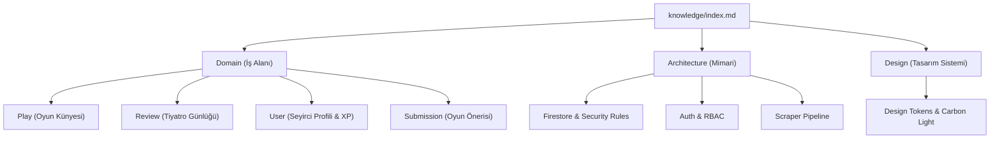

# Tiyatronot Open Knowledge Base (OKF)

Welcome to the canonical Open Knowledge Format (OKF) catalog for **Tiyatronot**—the digital playbill, critique, and discovery notebook for Turkish theatre.

This knowledge base provides an interconnected, deterministic graph of truth for AI agents and human developers.

## Knowledge Graph Overview

## Navigation Categories

### [System Architecture (Mimari ve Veri Akışı)](./architecture/index.md)

| Concept | ID | Tags |
| :--- | :--- | :--- |
| [Authentication & Role-Based Access Control](./architecture/auth.md) | `architecture/auth` | `auth`, `firebase-auth`, `rbac`, `security` |
| [Firestore Schema & Security Rules](./architecture/firestore.md) | `architecture/firestore` | `database`, `firestore`, `security-rules`, `permissions` |
| [Scraper & Seed Data Hydration Pipeline](./architecture/scraper.md) | `architecture/scraper` | `scraping`, `pipeline`, `seed`, `tiyatrolar` |

### [Design System (Carbon Tasarım Dili ve Tokenlar)](./design/index.md)

| Concept | ID | Tags |
| :--- | :--- | :--- |
| [Design Tokens & Carbon Light Theme](./design/tokens.md) | `design/tokens` | `design-system`, `carbon`, `tokens`, `typography` |

### [Domain Concepts (Tiyatronot İş Alanı)](./domain/index.md)

| Concept | ID | Tags |
| :--- | :--- | :--- |
| [Play (Oyun Künyesi)](./domain/play.md) | `domain/play` | `play`, `theatre`, `catalog`, `metadata` |
| [Review & Diary Entry (Tiyatro Günlüğü)](./domain/review.md) | `domain/review` | `review`, `diary`, `ratings`, `matine-suare` |
| [Play Submission & Community Curation (Oyun Önerisi)](./domain/submission.md) | `domain/submission` | `submission`, `moderation`, `curation`, `crowdsourcing` |
| [User Profile & Gamification (Seyirci Profili)](./domain/user.md) | `domain/user` | `user`, `auth`, `xp`, `gamification`, `badges` |

## Specifications & Audit
* **Specification:** Google Open Knowledge Format
* **Audit History:** [Change Log](./log.md)
* **Sync Engine:** `scripts/sync-okf.mjs`
* **Last Compiled:** 2026-09-10T19:26:57.926Z
